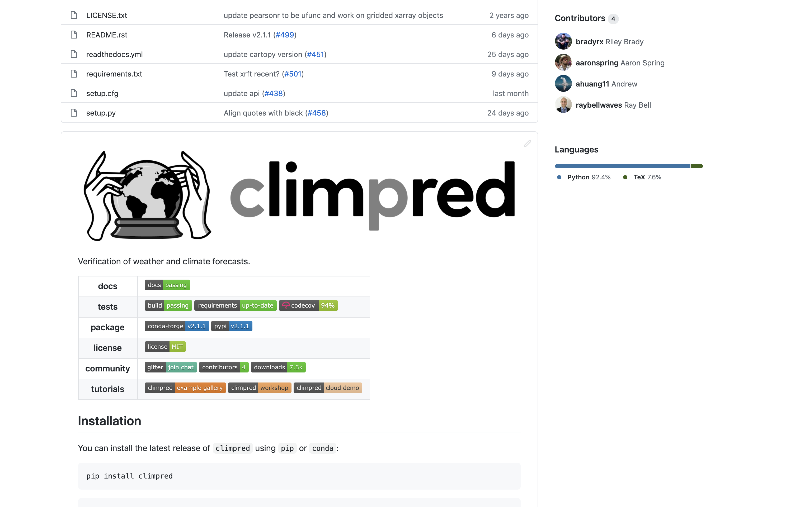

**Pangeo Use Case: Analyzing Initialized Climate Prediction System Datasets with climpred**

<font size="6">_Anderson Banihirwe ([@andersy005](https://github.com/andersy005)), Software Engineer_<font size="3">

<font size="5">National Center for Atmospheric Research (NCAR)</font>

<font size="6"><a href="https://www.cpc.ncep.noaa.gov/products/outreach/CDPW/45/">NOAA's 45th Climate Diagnostics & Prediction Workshop</a> | 2020-10-20</font>
<aside class="notes">
    <ul>
      <li>Thanks for the opportunity to speak.</li>
      <li>I work as a software engineer @ the National Center for Atmospheric Research (aka NCAR).</li>
      <li>Today, I am just going to talk about climpred, a Python package designed for handling ensemble re-forecast data.</li>
   </ul>
</aside>


## But first, a word about "Pangeo"


## Why Care?

**Problem (1)**: Our ability to produce large datasets from Earth System Models (ESM) 
<hr>
Has surpassed our ability to analyze them
<hr>

```console
❯ Example: The CMIP6-Decadal Climate Prediction Project (DCPP) output
❯ du -sh --dereference /glade/collections/cmip/CMIP6/DCPP
84T	/glade/collections/cmip/CMIP6
```


## Why Care?

**Problem (2)**: The sheer increase in available climate, weather datasets 

<hr>

demands that scientific analysis tools be **generic**, **frictionless** and **open source**.

<aside class="notes">
   <p>Generic software is software that can perform many different tasks. It is not limited to one particular application.</p>
</aside>


## Why Care?

**Problem (3)**: Scientists spend a considerable portion of their research time

<hr>

writing in-house, customized code solutions (e.g., NCL, MATLAB, GrADS, FORTRAN)  for handling forecast verifications, etc..

<aside class="notes">
   <p>Generic Software is harder to develop as one has to take into account a lot requirements which will be useful for a number of stakeholders/users.. So, scientists tend to prefer writing in-house, custom solutions</p>
</aside>


## Why Care?

**Question**: Can we spend more time analyzing output and less time writing (and re-writing) code?

<hr>

**Answer**: a resounding yes... and `climpred` strives to be among the solutions...


## climpred

[github.com/pangeo-data/climpred](github.com/pangeo-data/climpred)


<aside class="notes">
    <ul>
      <li>climpred is a high-level package that leverages the scientific python ecosystem to provide an interactive experience for analyzing initialized prediction systems, from file input to publication-ready visualizations.</li>
   </ul>
</aside>


### Features

- `HindcastEnsemble`: for climate prediction ensembles initialized by a data-like product.
- `PerfectModelEnsemble`: for **perfect model** climate prediction ensembles.
- `.verify()`: for verifying the initialized ensemble or predictions.
- `.bootstrap()`: for bootstraping with replacement according to Goddard et al.
- `metrics`
- Reference forecasts

See [API reference](https://climpred.readthedocs.io/en/stable/api.html#) for more details.


## Demo

<iframe width="560" height="315" src="https://www.youtube.com/embed/SKXUBD6DGao" frameborder="0" allow="accelerometer; autoplay; clipboard-write; encrypted-media; gyroscope; picture-in-picture" allowfullscreen></iframe>


## Developmental Roadmap

- Continuously adding new metrics and skill scores to the package. 
- Modularization of the bootstrapping system.
- Addition of new reference forecasts
  - Currently supported: `uninitialized` and `persistence`
  - Upcoming additions: `damped persistence`, `climatology`, `random mechanism`, etc...

<aside class="notes">
    <ul>
      <li>Development will always prioritize community users that raise issues and request features to aid in their workflow. </li>
      <li>Modularization: Allow the user to have more control over each step in the bootstrapping process.</li>
      <li>Reference forecasts: climpred currently only offers uninitialized and persistence reference forecasts against which to compare initialized forecast performance. We plan to add damped persistence, climatology, random mechanism, etc. in the future.</li>
   </ul>
</aside>


## Thanks!

- Please get involved!
  - https://github.com/pangeo-data/climpred
  - https://gitter.im/climpred
  - https://discourse.pangeo.io/


