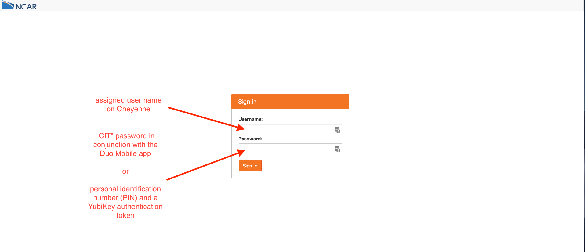
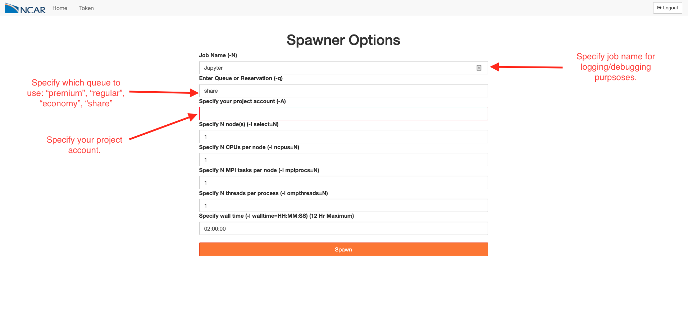
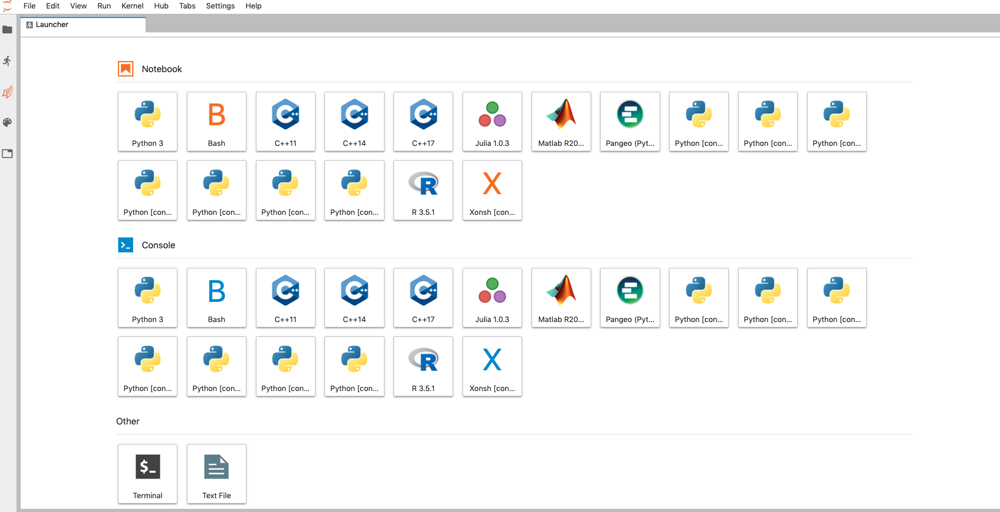
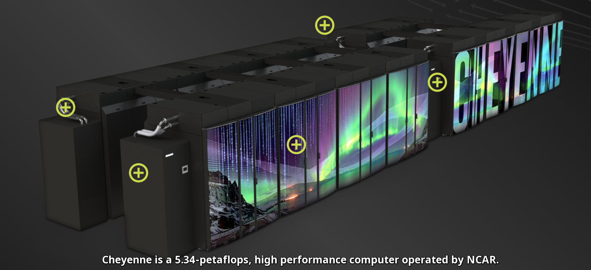

## Turning HPC Systems into Interactive Data Analysis Platforms using Jupyter and Dask


_Anderson Banihirwe, Software Engineer_

National Center for Atmospheric Research (NCAR)


### Motivation: Context

- Pressing need and opportunity for interactivity in supercomputing, both in data science and traditional applications, e.g.;
  - Data exploration 
  - Workflow experimentation  
  - Visualization  


### Motivation: Problem

- Batch job submission to a job queue means many slow iteration cycles for the users.
- HPC systems are a bit hard to use with anything other than MPI.


### Motivation: Goal

- Support interactive analytics on HPC systems as a first class service with **dask-jobqueue** and **jupyter**. 


### What is Interactive Supercomputing?

A more user friendly/centered way of using supercomputers:

- Interact with the job while it is running, rather than submitting to a batch queue and checking back the next day. <!-- .element: class="fragment" data-fragment-index="1" -->
- Often involves a modern UI/UX. <!-- .element: class="fragment" data-fragment-index="2" -->
- Scaling: computing resources should scale adaptively based on the workload. <!-- .element: class="fragment" data-fragment-index="3" -->
- Responsiveness: short jobs or tasks should start, complete, and return control to the user quickly. <!-- .element: class="fragment" data-fragment-index="4" -->


### Why is Interactivity Needed for Data Analysis?

- Data analysis is inherently a "human-in-the-loop" workflow: <!-- .element: class="fragment" data-fragment-index="1" -->
  - May not have a concretely expressible goal: given a high-resolution global dataset of monthly climate, find "something interesting".
  - "I will know it when I see it"
  - Many trials, previous trials often inform what you try next.
- Without interactivity, we lose the argument for using HPC for Data analysis. <!-- .element: class="fragment" data-fragment-index="2" -->


### Tools for Turning HPC Systems into Interactive Data Analysis Platforms


### Interactivity Tools: Jupyter Notebooks

- Code interactively
- Run in a web browser
- Integrate different forms of media and content:
  - Code cells and their outputs
  - Graphical widgets
  - Narrative text


### Interactivity Tools: Running Jupyter Notebooks on HPC systems


**Commonly, inconvenient used setup:**

- **SSH-in**
```console
$ ssh <remote_user>@<remote_host>
```

- **Launch Jupyter on a remote machine**
```console
$ jupyter lab --no-browser --ip=`hostname` --port=<port>
```

- **From the local machine, set up SSH-tunnel to the remote machine**
```console
$ ssh -N -L <port>:<hostname>:<port> <remote_user>@<remote_host>
```

- **Open the notebook in a browser on the local machine**
```console
$ open http://localhost:<port>/
```


### Interactivity Tools: JupyterHub to rescue

- Provide a general-purpose point-of-entry to interactive high performance computing services.
- Centralized service to:
  - provide Jupyter Server
  - authenticate and manage users in a standard manner


### JupyterHub @ NCAR: Login
https://jupyterhub.ucar.edu/



### JupyterHub @ NCAR: Specifying Job Configuration
https://jupyterhub.ucar.edu/



### JupyterHub @ NCAR: A Running Jupyter Server
https://jupyterhub.ucar.edu/



### Interactivity Tools: Dask

- Library for parallel programming..
- Designed to scale data libraries like NumPy, Pandas, Scikit-Learn while using a familiar API...
- Runs in parallel using many threads / processes / machines.
- Easy to deploy on personal computers, cloud, and **hpc systems**.


### Interactivity Tools: Dask-jobqueue

- Library for deploying dask on HPC systems. 
- Created as a spinoff of the Pangeo project.
- Allows dask to interact natively with traditional HPC job schedulers like:
  - PBS, SLURM, SGE, Torque, LSF...
  - and others commonly found on HPC systems...


### Interactivity Tools: Dask-jobqueue

- Provides a _Pythonic_ user interface that manages dask workers/clusters through 
  - submission
  - execution
  - and deletion of individual jobs on an HPC system...


### Interactivity Tools: Dask-jobqueue

```python
from dask_jobqueue import PBSCluster
from distributed import Client
cluster = PBSCluster(project=..., queue=..., cores=1,
                     processes=1, memory="20GB",
                     walltime="00:30:00")

# Manually scale by asking for ten dask workers
cluster.scale(10)

# OR scale adaptively based on the workload
cluster.adapt(minimum=1, maximum=100, wait_count=60)

# Connect this local process to remote workers
client = Client(cluster)
```

_Note_: The cluster object stores essentially a configuration for a block of worker nodes that you will be requesting...


### Interactivity Tools: Adaptive scaling

_Challenges:_ 
- Balancing cluster resources and performance can be challenging, and requires a lot of experimentation...
- Computational workloads aren't constant, they rather fluctuate throughout the analysis...


### Interactivity Tools: Adaptive scaling

_Solutions:_
- Start your Jupyter Notebook, instantiate your dask cluster, and then do science...
- Let dask determine when to scale up and/or down depending on the commputational workload...


### Interactivity Tools: Adaptive scaling & Resilience

_Benefits:_
- Dask's adaptive scaling improves HPC systems' occupancy / utilization...
- Dask’s resilience against the death of all or part of its workers provides new ways of leveraging job preemption...


### Live Demonstration


 
### Questions? Thoughts?

- [Dask-jobqueue workshop materials](https://github.com/willirath/dask_jobqueue_workshop_materials)
- https://dask.pydata.org/
- https://jobqueue.dask.org/
- https://distributed.dask.org/
- https://github.com/jupyterhub
- [Jupyter for Science User Facilities and High Performance Computing workshop](https://jupyter-workshop-2019.lbl.gov/agenda)

**Participate**

Community Issue Tracker: [github.com/pangeo-data/pangeo](https://github.com/pangeo-data/pangeo/issues)
