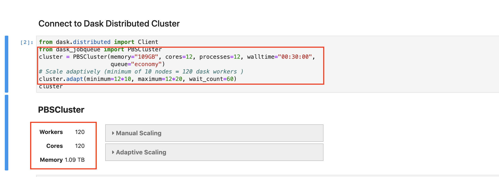
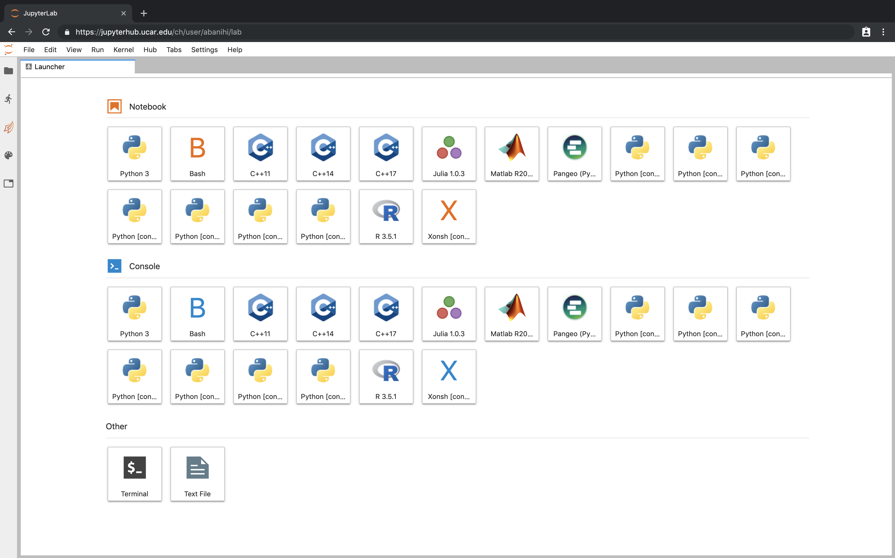

## Interactive Supercomputing with Jupyter and Dask


_Anderson Banihirwe, Software Engineer_

National Center for Atmospheric Research (NCAR)

<font size="5">Slides: https://andersonbanihirwe.dev/talks/dask-jupyter-scipy-2019.html</font>

<font size="5">Github: [@andersy005](https://github.com/andersy005)</font>

<font size="4">SciPy 2019, Austin, TX.</font > 


<div class="row">
  <div class="column">
    
    <ul>
     <li> Alice, project scientist @ NCAR </li>
     <li> Field of Expertise: Hydrology/Hydrometeorolgy</li>
    </ul>
  </div>
   
  <div class="column">
    
  </div>
</div>
  


### 1) NCAR Infrastructure
<hr>


### 2) Dask-jobqueue in Action
<hr>



### 3) Actual Science
<hr>


</div>


### What do we mean by supercomputing?


**WHAT DO WE MEAN BY SUPERCOMPUTING?**
<hr>

- MPI, batch processing...
- Lots of heavy machines managed by sysadmins...
  
<font size="4">Cheyenne is a 5.34-petaflops, high-performance computer operated by NCAR.</font>


### What do we mean by Interactive Supercomputing?


**WHAT DO WE MEAN BY INTERACTIVE SUPERCOMPUTING?**
<hr>

<!-- - A **human-in-the-loop** workflow, rapid iteration...
- Jupyter notebooks, numpy/pandas/visualization... 
- Adaptive scaling of computing resources based on the workload..

 

 -->

<div class="row">
  <div class="column">
    
  </div>
  <div class="column">
    <ul>
  <li>Need for more <bold>"human-in-the-loop"</bold> workflows, rapid iteration due to huge growth in data creation</li>
  <li>Jupyter notebooks, interactive visualization, etc</li>
  <li>Adaptive scaling of computing resources based on the load</li>
</ul>
  </div>
</div>

**This combination would be powerful...** <!-- .element: class="fragment" data-fragment-index="2" -->

**But it is hard...** <!-- .element: class="fragment" data-fragment-index="3" -->

Note:

- Interact with the job while it is running, rather than submitting to a batch queue and checking back the next day. 
- Often involves a modern UI/UX.
- Adaptive scaling based on the workload
- Responsiveness: short jobs or tasks should start, complete, and return control to the user quickly. 
- Data analysis is inherently a "human-in-the-loop" workflow: 
  - May not have a concretely expressible goal: given a high-resolution global dataset of monthly climate, find "something interesting".
  - "I will know it when I see it"
  - Many trials, previous trials often inform what you try next.
- Without interactivity, we lose the argument for using HPC for Data analysis. 


### Interactive Supercomputing Challenges
<hr>

- Every high performance computing (HPC) system is unique:
  - Security policies
  - Container experience/policy
  - Queue configuration
  - External node access policies
- Tension between interactive availability and machine utilization (HPC centers often measured on this)... 
- Lack of "elastic scaling" support in HPC workload managers... 
  

Note:

- Traditional HPC workloads managers don’t have good
support for growing and shrinking allocations based on
availability and/or demand
- Holding unused resources leads to poor utilization
and/or expensive for users


### Enabling Technologies for Interactive Supercomputing


<div class="row">
  <div class="column">
   
  </div>
  <div class="column">
    <ul>
  <li><bold>Interactive</bold>, web browser-based computing environment</li>
  <li><bold>Reproducible</bold> document format.
  <ul>
  <li>Code</li>
  <li>Prose</li>
  <li>Equations (LaTeX)</li>
  <li>Visualizations</li>
  </li>

</ul>
  </div>
</div>


### JUPYTER NOTEBOOKS ON HPC SYSTEMS
<hr>

**Q: But isn't Jupyter already usable on HCP systems?**


**Q: But isn't Jupyter already usable on HCP systems?**
<hr>

**A: Yes, But......**

- **SSH-in**
```console
$ ssh <remote_user>@<remote_host>
```
- **Launch Jupyter on a remote machine**
```console
$ jupyter lab --no-browser --ip=`hostname` --port=<port>
```
- **Set up SSH-tunnel to the remote machine**
```console
$ ssh -N -L <port>:<hostname>:<port> <remote_user>@<remote_host>
```
- **Open the notebook in a browser on the local machine**
```console
$ open http://localhost:<port>/
```


### Jupyter Notebooks on HPC systems
<hr>

**What is missing?**

- Multi-user support
- Pure web-access to HPC resources


to the rescue...

<div class="row">
  <div class="column">
   
  </div>
  <div class="column">
    <ul>
  <li>Manages authentication</li>
  <li>Spawns single-user servers on-demand</li>
  <li>Each user gets a complete notebook server</li>
</ul>
  </div>
</div>


### JupyterHub @ NCAR


**JupyterHub @ NCAR: Login**


**JupyterHub @ NCAR: Specifying Job Configuration**


**JupyterHub @ NCAR: A Running Jupyter Server**




### JupyterHub Live Demo 
<font size="3">(if live demo gods are in a good mood...)</font>

<iframe width="560" height="315" src="https://www.youtube.com/embed/dlrtt74FMCs" frameborder="0" allow="autoplay; encrypted-media" allowfullscreen></iframe>


<div class="row">
  <div class="column">
    <ul>
  <li>Parallel programming library for Python</li>
  <li>Scales data libraries like Numpy, Pandas, Scikit-Learn, Xarray... </li>
  <li>Deploys on HPC systems</li>
  <li>Culturally native to Scientific Computing</li>
</ul>
  </div>
   <div class="column">
   <ul>
   <li>Provides schedulers for executing task graphs</li>
   </ul>
    
  </div>
</div>

<!-- -  Parallel programming library for Python
-  Scales data libraries like Numpy, Pandas, Scikit-Learn
-  Deploys on HPC systems
-  Culturally native to Scientific Computing
- Provides schedulers for executing task graphs
 -->


### Dask-jobqueue


**DASK-JOBQUEUE**
<hr>

- Easily deploy Dask on job queuing systems like PBS, Slurm, MOAB, SGE, and LSF, etc...
- Created as a spinoff of the Pangeo project.
- Pythonic user interface that manages dask workers/clusters


**DASK-JOBQUEUE**
<hr>

<div class="row">
  <div class="column">
    <code class="python">
    
    from dask_jobqueue import PBSCluster
    from distributed import Client
    cluster = PBSCluster(project=.., 
      queue=.., cores=1, processes=1, 
      memory="100GB", walltime=...)
    # Ask for 10 nodes 
    cluster.scale(10)
    # OR scale adaptively based on load
    cluster.adapt(minimum=1, maximum=100, 
                wait_count=60)
    # Connect to remote workers
    client = Client(cluster)

   </code>
  </div>
   <div class="column"> 
   <code class="python"> <!-- .element: class="fragment" data-fragment-index="3" -->
    
    from dask_jobqueue import SLURMCluster
    from distributed import Client
    cluster = SLURMCluster(project=.., 
      queue=.., cores=1, processes=1, 
      memory="100GB", walltime=...)
    # Ask for 10 nodes 
    cluster.scale(10)
    # OR scale adaptively based on load
    cluster.adapt(minimum=1, maximum=100, 
                wait_count=60)
    # Connect to remote workers
    client = Client(cluster)

   </code>
  </div>
</div>

<font size="4">Note: The cluster object stores a configuration for a block of worker nodes that you will be requesting...</font>


### Dask-jobqueue Live Demo
<font size="3">(if live demo gods are in a good mood...)</font>

<iframe width="560" height="315" src="https://www.youtube.com/embed/QUzFis0VZac" frameborder="0" allow="autoplay; encrypted-media" allowfullscreen></iframe>


### Adaptive/Elastic scaling, Resilience, etc...


### Adaptive/Elastic scaling
<hr>

_Challenges:_ 
- Balancing cluster resources and performance
  - is challenging
  - requires a lot of experimentation...
- Computational workloads fluctuate throughout the analysis...

**Dask thinks about ...** <!-- .element: class="fragment" data-fragment-index="2" -->

- Scaling up and down <!-- .element: class="fragment" data-fragment-index="2" -->
- Resilience <!-- .element: class="fragment" data-fragment-index="2" -->
- Load balancing <!-- .element: class="fragment" data-fragment-index="2" -->


### Adaptive/Elastic scaling on HPC systems
<hr>

_Solution:_

1. Start your Jupyter Notebook
2. Instantiate your dask cluster
3. Let dask determine when to scale up and/or down
4. **Do science**


### Adaptive/Elastic scaling on HPC systems
<hr>

_Benefits:_

- Adaptive scaling improves HPC systems' occupancy / utilization...
- Resilience against the death of all or part of computing resources provides new ways of leveraging job preemption...

**Dask thinks about these benefits...** <!-- .element: class="fragment" data-fragment-index="2" -->


### Not all jobs are interactive


### Future

- Heterogeneous resources handling
- Coarse-Grained Diagnostics and History
- Scheduler Performance on Large Graphs
 


### Resources

- https://jobqueue.dask.org/
- https://mpi.dask.org
- [Dask-jobqueue workshop materials](https://github.com/willirath/dask_jobqueue_workshop_materials)
- [Jupyter for Science User Facilities and High Performance Computing workshop](https://jupyter-workshop-2019.lbl.gov/agenda)

**Participate**

- https://github.com/dask/dask-jobqueue/issues
- https://github.com/dask/dask-mpi/issues


### Acknowledgments!

- Jupyter/JupyterHub development teams
- NCAR/CISL Supercomputer Systems, Consulting Services Groups
- Pangeo collaborators
