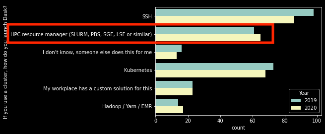
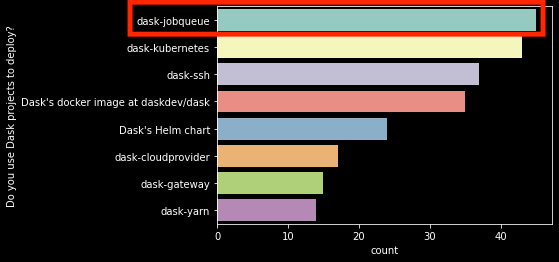

### The Current State of Deploying 

### on HPC Clusters
---
_Anderson Banihirwe_, [@andersy005](https://github.com/andersy005)

Software Engineer @ The US National Center for Atmospheric Research

Dask Distributed Summit | 2021-05-19

### Why Care?

**2020 Dask User Survey**<!-- .element: class="fragment" data-fragment-index="1" --> 

  

    <!-- .element: class="fragment" data-fragment-index="2" -->
  

  
  

    <!-- .element: class="fragment" data-fragment-index="2" -->
  

_https://blog.dask.org/2020/09/22/user_survey_<!-- .element: class="fragment" data-fragment-index="2" -->

### What is Dask-jobqueue? 

- Easily deploy Dask on HPC workload managers like PBS, Slurm, MOAB, SGE, and LSF, etc...<!-- .element: class="fragment" data-fragment-index="1" -->
- Provides a Pythonic user interface that manages dask clusters<!-- .element: class="fragment" data-fragment-index="2" -->

### First, what is a dask cluster?

**One common API across all major HPC scheduler systems**

  

    <code class="python"><!-- .element: class="fragment" data-fragment-index="1" -->
    
    from dask_jobqueue import PBSCluster
    from distributed import Client
    cluster = PBSCluster(project=.., 
      queue=.., cores=1, processes=1, 
      memory="100GB", walltime=...)
    # Ask for 10 nodes 
    cluster.scale(10)
    # OR scale adaptively based on load
    cluster.adapt(minimum=1, maximum=100, 
                wait_count=60)
    # Connect to remote workers
    client = Client(cluster)

   </code>
  

   
 
   <code class="python"> <!-- .element: class="fragment" data-fragment-index="2" -->
    
    from dask_jobqueue import SLURMCluster
    from distributed import Client
    cluster = SLURMCluster(project=.., 
      queue=.., cores=1, processes=1, 
      memory="100GB", walltime=...)
    # Ask for 10 nodes 
    cluster.scale(10)
    # OR scale adaptively based on load
    cluster.adapt(minimum=1, maximum=100, 
                wait_count=60)
    # Connect to remote workers
    client = Client(cluster)

   </code>
  

### Challenges

- The universe of HPC clusters is extremely diverse<!-- .element: class="fragment" data-fragment-index="1" -->
  - Very challenging for Dask-jobqueue to be generic and cover all edge cases of some HPC clusters<!-- .element: class="fragment" data-fragment-index="2" -->
- Queue configurations and HPC center policies:<!-- .element: class="fragment" data-fragment-index="3" -->
  - Lack of "responsive interactive" queues limits the autoscaling feature of a dask cluster.<!-- .element: class="fragment" data-fragment-index="4" -->
  - Tension between interactive availability and machine utilization (HPC centers often measured on this).<!-- .element: class="fragment" data-fragment-index="5" -->

### Dask-mpi: NOT ALL JOBS ARE INTERACTIVE

- Easily deploy Dask in an existing MPI environment<!-- .element: class="fragment" data-fragment-index="1" -->
- Well suited for "batch" jobs<!-- .element: class="fragment" data-fragment-index="2" -->
  - Plays nicely with the HPC workload managers<!-- .element: class="fragment" data-fragment-index="2" -->

### Most wanted features

- Heterogeneous resources handling<!-- .element: class="fragment" data-fragment-index="1" -->
  - Workers with low or high memory<!-- .element: class="fragment" data-fragment-index="2" -->
  - Workers with GPUs<!-- .element: class="fragment" data-fragment-index="2" -->
  - Workers in different queues<!-- .element: class="fragment" data-fragment-index="3" --> 
