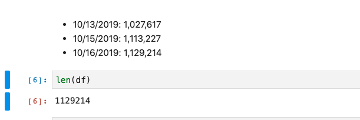
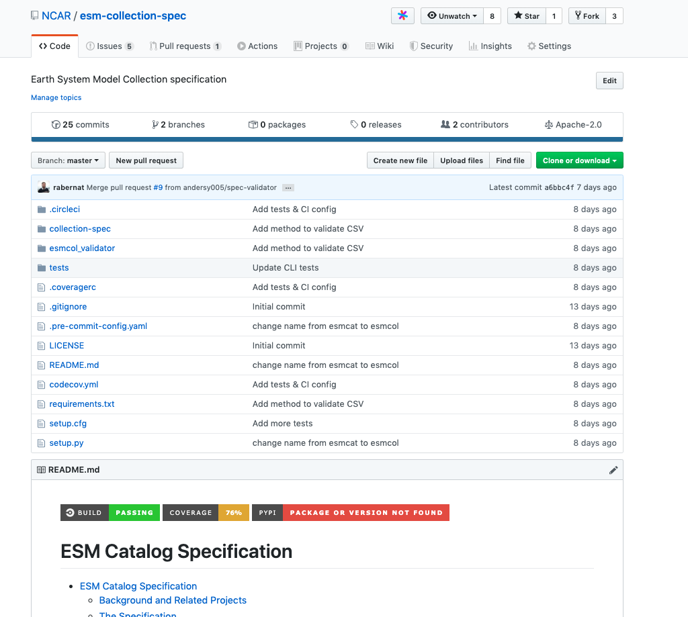
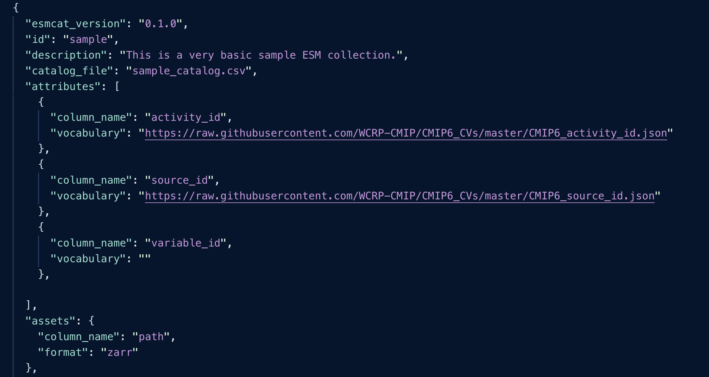
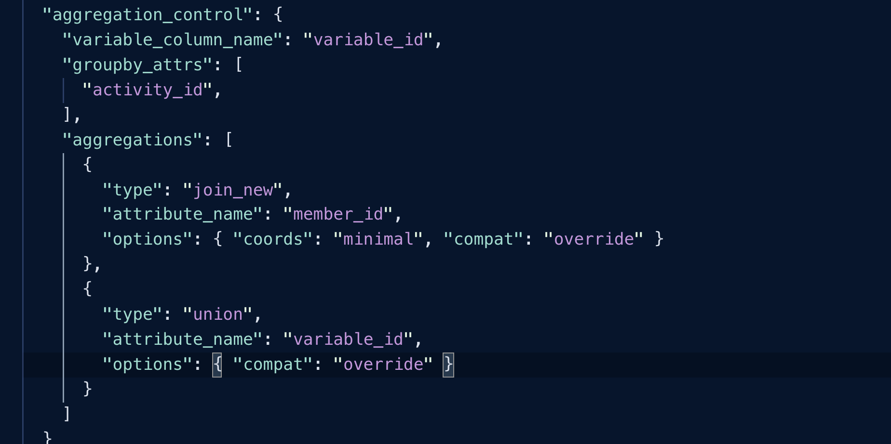
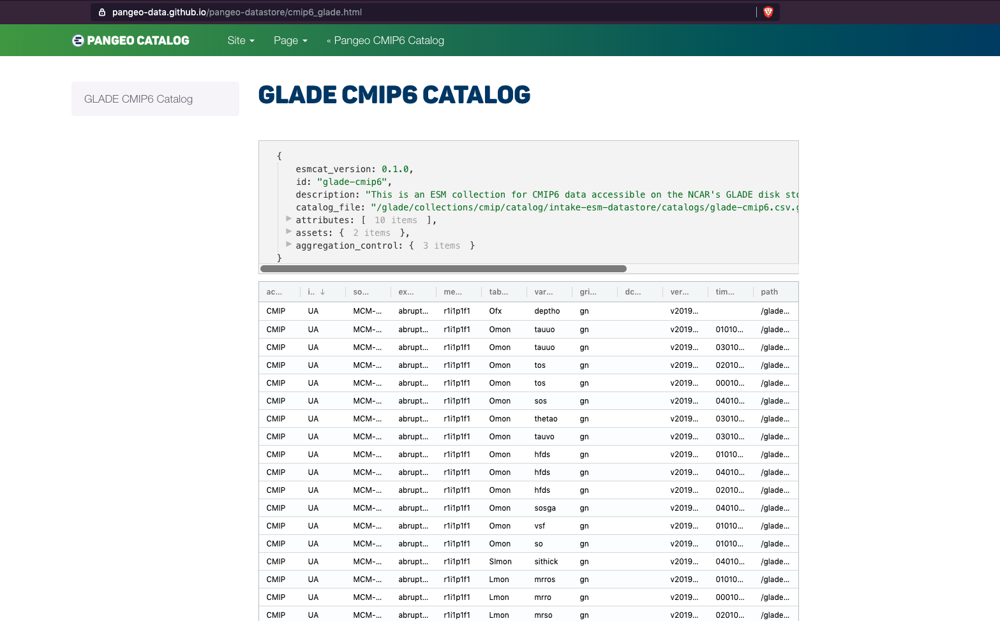

## Intake-esm 
## -
### Making It Easier To Consume Climate Data

<font size="5">_Anderson Banihirwe ([@andersy005](https://github.com/andersy005)), Software Engineer_<font size="3">

<font size="5">National Center for Atmospheric Research (NCAR)</font>

<font size="4">CMIP6 Hackathon 2019, Boulder, CO.</font> 


### Motivating Factor 

**Total number of netCDF files for CMIP6 Data on NCAR's Glade over time**



<div>
<b>Data User:</b> How do I really <em>find</em>, <em>investigate</em>, <em>load</em> these data assets into data array containers?
</div>


```python
import xarray as xr
from pathlib import Path
root = """/glade/collections/cmip/CMIP6/CMIP/NCAR/
        CESM2/1pctCO2/r1i1p1f1/Amon/co2/gn/latest"""
root_dir = Path(root)
filenames = ["co2_Amon_CESM2_1pctCO2_r1i1p1f1_gn_000101-005012.nc", 
"co2_Amon_CESM2_1pctCO2_r1i1p1f1_gn_005101-010012.nc", 
"co2_Amon_CESM2_1pctCO2_r1i1p1f1_gn_010101-015012.nc"]
dsets = []
for fn in filenames:
    path = root_dir / fn
    d = xr.open_dataset(path.as_posix(), chunks={'time': 36})
    dsets.append(d)
# Concatenate datasets along the time dimension/axis
ds = xr.concat(dsets, dim='time')
```

```python
# OR
files = f"{root}/*.nc"
ds = xr.open_mfadaset(files, concat_dim="time", combine="by_coords,
                      chunks={'time': 36})
```


### Introducing Intake-esm

- A data cataloging utility built on top of intake, pandas, and xarray

```python
import intake
col = intake.open_esm_datastore("glade-cmip6.json")
cat = col.search(activity_id="CMIP", source_id="CESM2",
                 experiment_id="1pctCO2", variable_id="co2",
                 table_id="Amon", grid_label="gn")
dsets = cat.to_dataset_dict(cdf_kwargs={"chunks" : {"time" : 36}})
```


### Data User

- What datasets are available?
- Which dataset is the most appropriate?
- Load the data and analyze it


### Data Provider

- Direct the user
- Enable users to easily onboard new data with structured workflows
- Provide complete information about the data at a user’s fingertips


### ESM (Earth System Model) Collection Specification


via https://xkcd.com/927/





### ESM Collection

- A single JSON file
- Provides metadata about the catalog (a CSV file)
  - Tells us what we expect to find inside the catalog
  - Tells us how to open it the catalog
  - How to aggregate compatible groups of data assets








### ESM Catalog Browser




### Demonstration

<iframe width="1200" height="600" src="https://www.youtube.com/embed/zjjpByZ0nOk" frameborder="0" allow="accelerometer; autoplay; encrypted-media; gyroscope; picture-in-picture" allowfullscreen></iframe>


### Learn More

- ESM Collection Specification: https://github.com/NCAR/esm-collection-spec
- Intake-esm: https://github.com/NCAR/intake-esm
- Intake-esm-datastore: https://github.com/NCAR/intake-esm-datastore
- Intake: https://intake.readthedocs.io
