## Intake-esm 

**Making It Easier To Consume Climate and Weather Data**

<font size="5">_Anderson Banihirwe ([@andersy005](https://github.com/andersy005)), Software Engineer_<font size="3">

<font size="5">National Center for Atmospheric Research (NCAR)</font>

<font size="4">2020 ESIP Summer Meeting</font>
<aside class="notes">
    <ul>
      <li>Thanks for the opportunity to speak.</li>
      <li>I work as a software engineer @ the National Center for Atmospheric Research (aka NCAR).</li>
      <li>I am also a member of the Pangeo community.</li>
      <li>Today, I am just going to talk about intake-esm, which is a Python data discovery/cataloging tool for earth system model outputs.</li>
   </ul>
  </aside>


### The 80/20 data science dilemma

Do data scientists spend 80% of their time gathering & cleaning data?

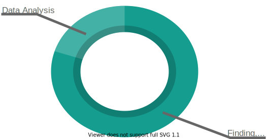


### Typical workflow: without a data catalog

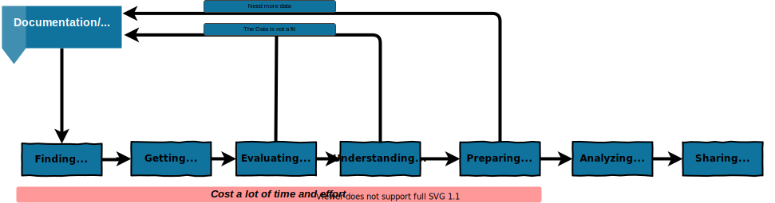

So much time ⏰ is spent on finding and understanding data


### Refined workflow: with a data catalog 

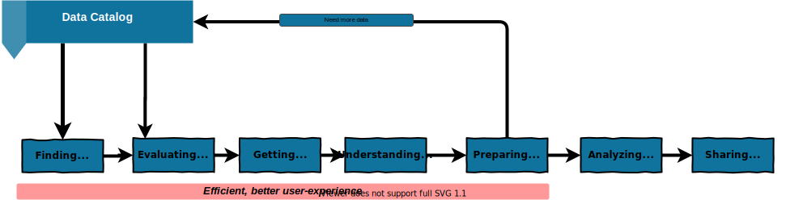


### Refined workflow: with a data catalog

**With a data catalog**, can we shift from 80% of time spent finding data and only 20% on analysis to 20% finding and preparing data with 80% for analysis?

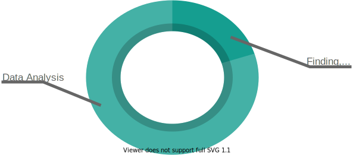


### Introducing [intake-esm](https://intake-esm.readthedocs.io/en/latest/)

- A data cataloging utility built on top of [intake](https://intake.readthedocs.io/en/latest/), pandas, and xarray. 

- Objectives include facilitating:

    - the discovery of earth's climate and weather datasets via Earth System Model (ESM) data catalog
    - the seamless ingestion of these datasets into xarray dataset containers.


### Exploring intake-esm Features: CMIP6  Use Case

<div class="row">
  <div class="column">
    <ul>
     <li> The Coupled Model Intercomparison Project (CMIP) (currently in phase 6) is an experimental framework for studying past, present and future climate changes.</li>
     <li> CMIP products represent one of society's most important sources of high quality and reliable climate information. </li>
    </ul>
  </div>
  
  <div class="column">
    
  </div>
</div>


### Exploring intake-esm Features: CMIP6  Use Case

```bash
$ # Total number of netCDF files for CMIP6 Data
$ # available on NCAR's GLADE filesystem as of 2020-07
$ cd /glade/collections/cmip/CMIP6
$ find -L . -type f -name "*.nc" | wc -l
3344778
$ du -sh --apparent-size --dereference .
1.1P	.
```


#### Opening an Earth System Model (ESM) catalog
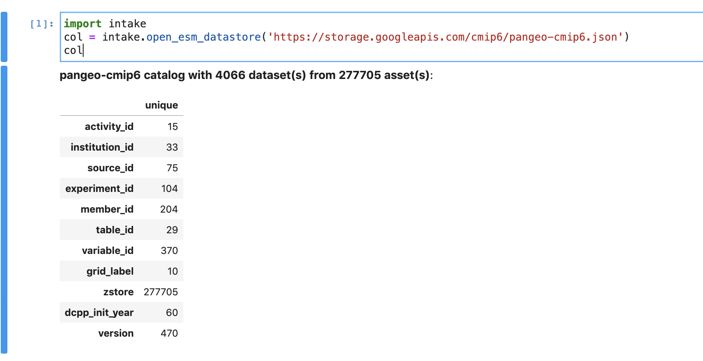


#### ESM catalog
<div class="row">
  <div class="column">
    <ul>
     <li> A single JSON file </li>
     <li> Provides metadata about the catalog (a CSV file)</li>
     <li>Tells us what we expect to find inside the catalog</li>
     <li>How to aggregate/combine compatible groups of data assets</li>
    </ul>
  </div>
   
  <div class="column">
    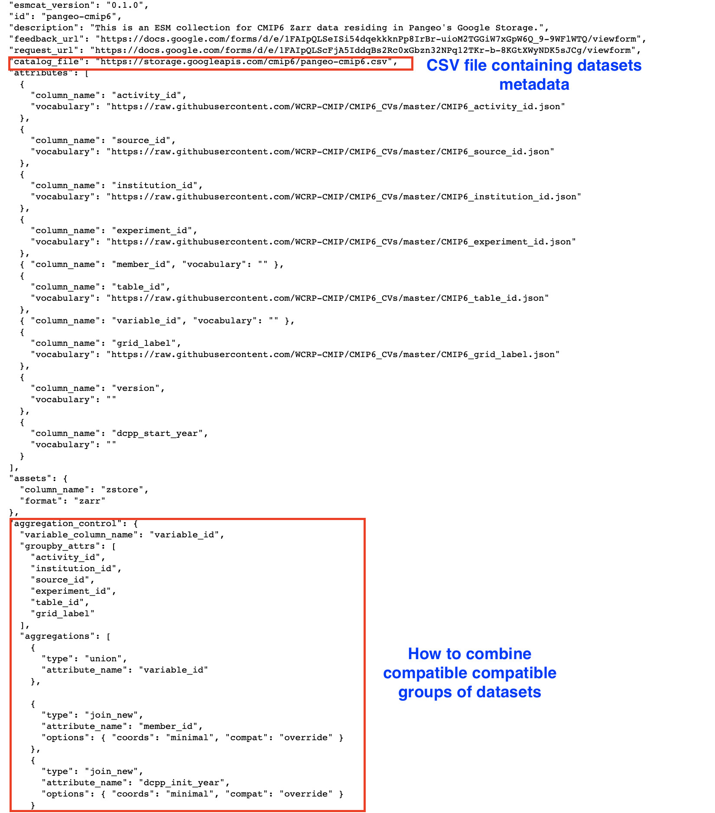
  </div>
</div>


#### Dataset Evaluation

Preview a dataset and its associated metadata without needing to download or acquire data first
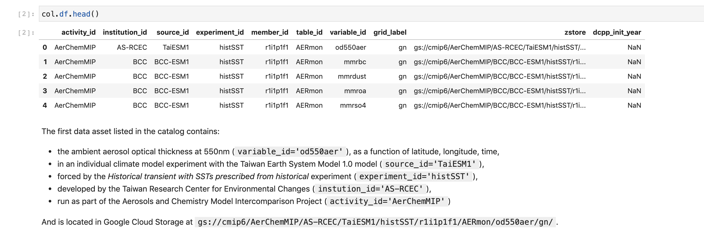


#### Dataset Searching

Search by facets, keywords, patterns etc.
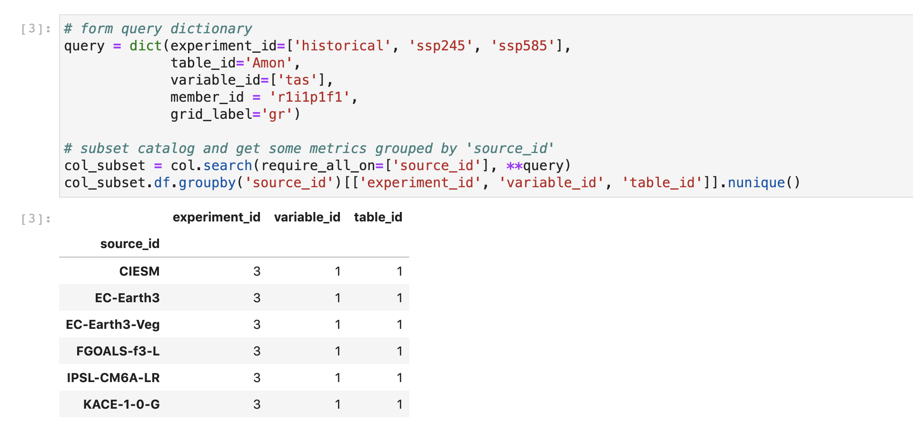


#### Data Access

`intake-esm` knows access protocols and provides access directly or interoperates with access technologies
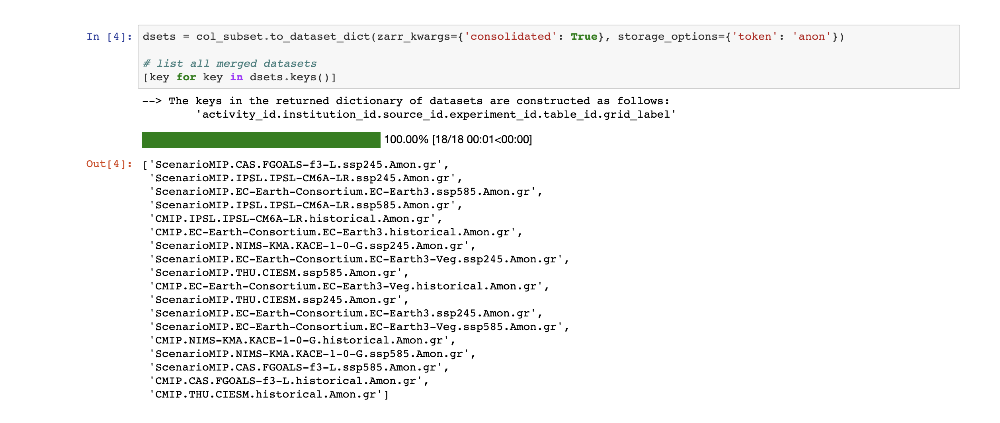


#### Data Analysis

`intake-esm` gets out of your way
  
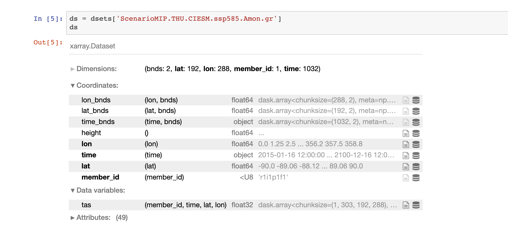


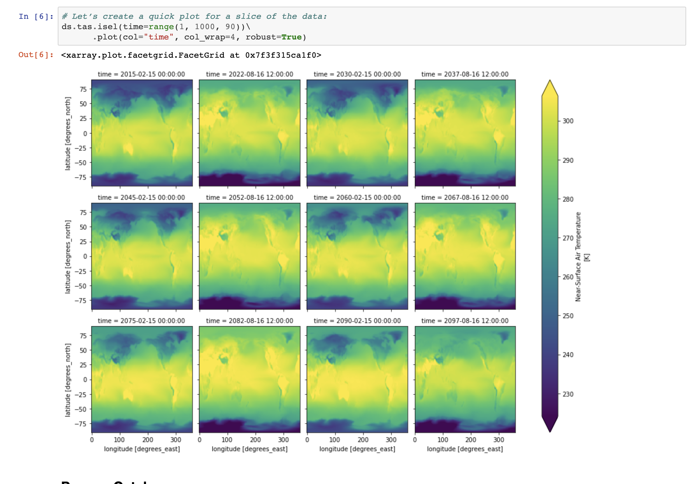


### Accessing catalogs using catalog.pangeo.io

- The Pangeo project offers a means of viewing catalogs from a standalone web application.

- CMIP6 catalog browser: https://catalog.pangeo.io/browse/master/climate/cmip6_gcs/


### Accessing catalogs using catalog.pangeo.io


### Accessing catalogs using catalog.pangeo.io


### What's Next?

- Merging ESM collection specifications into [SpatioTemporal Asset Catalog (STAC) specification](https://stacspec.org/) to offer a more universal specification standard
  - https://github.com/NCAR/esm-collection-spec/issues/21
- Development of tools to verify and describe catalogued data on a regular basis
- Please reach out if you are interested in participating in any way.
  - Pangeo Discourse: https://discourse.pangeo.io/
  - Intake-esm: https://github.com/intake/intake-esm
