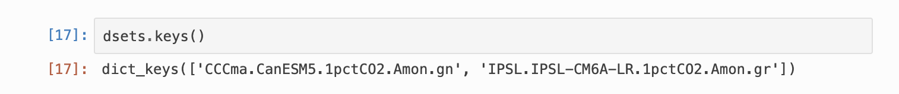
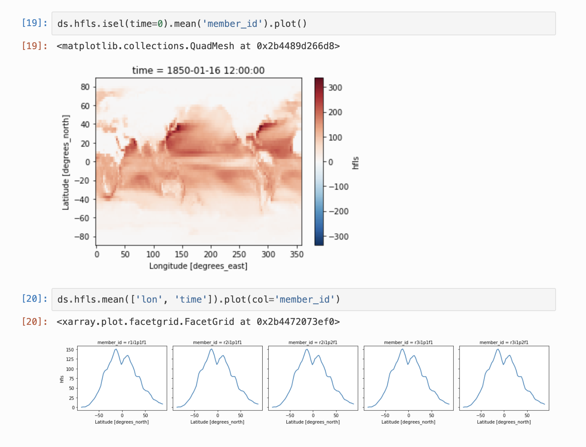

## intake-esm

_Anderson Banihirwe ([@andersy005](https://github.com/andersy005)), Software Engineer_

National Center for Atmospheric Research (NCAR)

Pangeo Meeting 2019, Seattle, WA. 

### Introducing Intake-esm

### Introducing Intake-esm

- A plugin for creating **file-based** intake catalogs
- Provides functionality for searching and discovering of datasets by eliminating the need for the user to know unnecessary details.
- A set of custom drivers for loading a variety of datasets

### Dataset Collection Curation

### Building and Opening collection catalogs

### Collection catalog

### Collection catalog

### Collection catalog summary

### Collection catalog summary

### Search and Discovery

### Search and Discovery

### Loading data into xarray datasets

### Intake-esm gets out of your way

### Intake-esm gets out of your way

### Thanks!

- Intake-esm: https://github.com/NCAR/intake-esm
- Intake-esm documentation: https://intake-esm.readthedocs.io
- Intake-esm-datastore: https://github.com/NCAR/intake-esm-datastore
- Intake: https://intake.readthedocs.io
