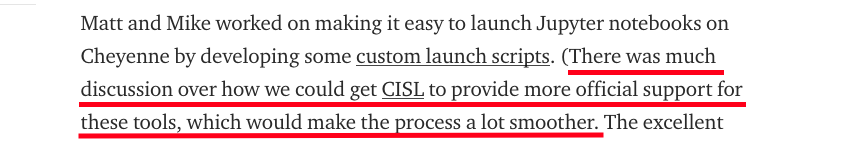
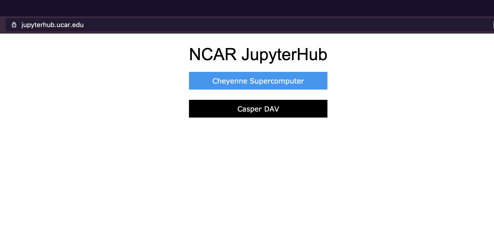
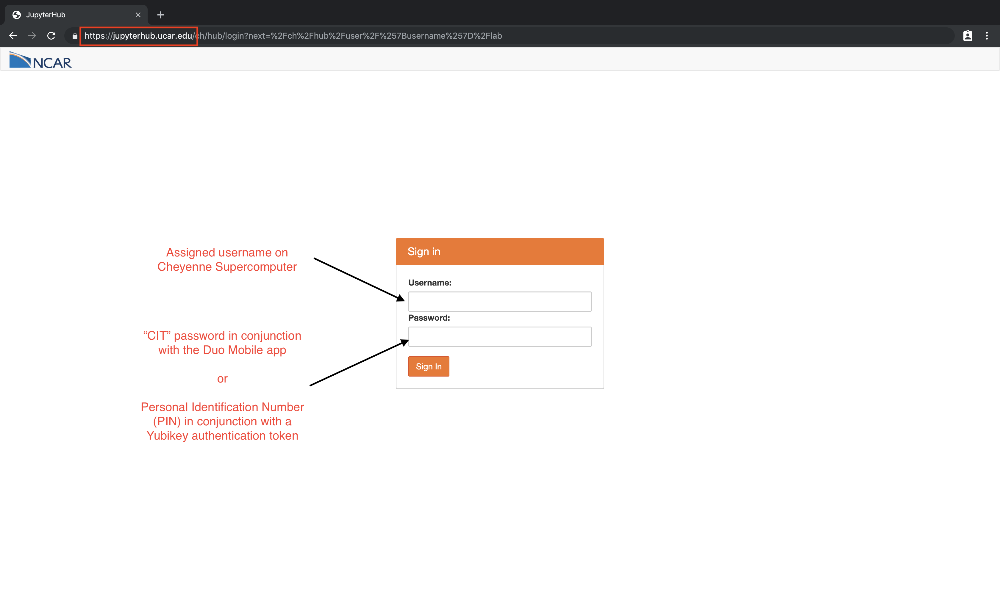
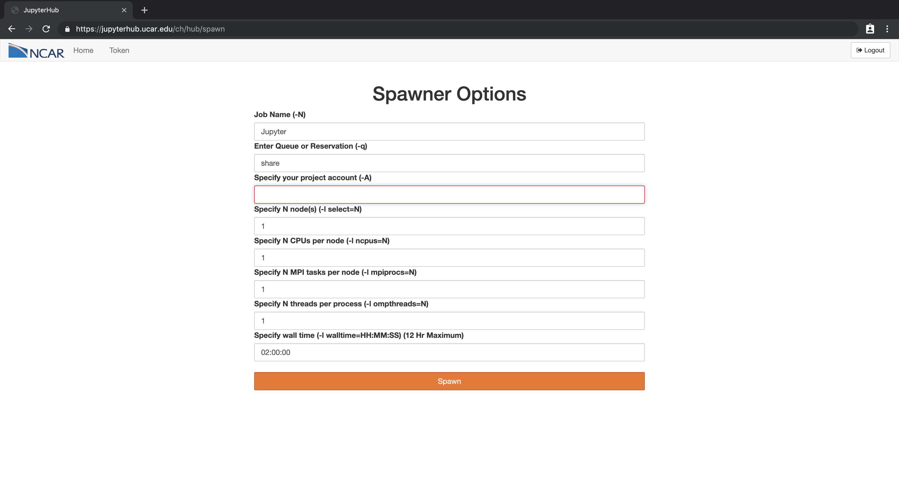
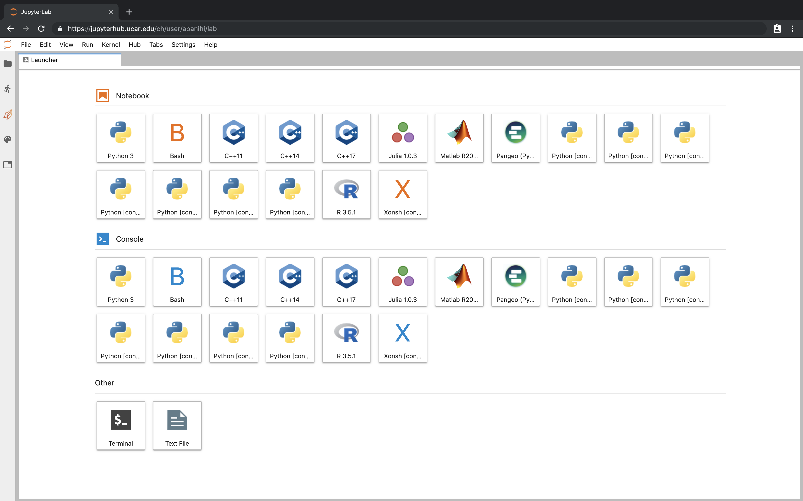

## On HPC

_Anderson Banihirwe ([@andersy005](https://github.com/andersy005)), Software Engineer_

National Center for Atmospheric Research (NCAR)

Pangeo Meeting 2019, Seattle, WA. 

### 2018: Pangeo Meeting Wishlist

- [Can we improve the user experience?](https://medium.com/pangeo/the-2018-pangeo-developers-workshop-1be359dac33c)
  

> If only there was a way to run Jupyter notebooks on HPC as a service...
<!-- .element: class="fragment" data-fragment-index="2" -->
https://medium.com/pangeo/the-2018-pangeo-developers-workshop-1be359dac33c<!-- .element: class="fragment" data-fragment-index="2" -->

### 2019: Dreams Do Come True*

  
Along comes JupyterHub on Cheyenne: 
https://dailyb.cisl.ucar.edu/bulletins/jupyterhub-available-use-pre-production-mode 

## Login/Authentication

## Specifying Job Configuration

Thanks to batchspawner: https://github.com/jupyterhub/batchspawner

## Default + Custom Kernels

## Pangeo Loves Science

### 2021: JupyterHub becomes a **first-class service** on Cheyenne's successor! 

https://dailyb.cisl.ucar.edu/bulletins/jupyterhub-available-use-pre-production-mode 

### 2019: Wishlist

- Testable deployment
  - Would love to hook into JupyterHub's test framework
  - Get CI testing during development - not there yet (:
- Continuous JupyterHub performance monitoring
- JupyterHub Status Page (extension??) for communicating:
  - incidents
  - scheduled maintenances
  - downtimes

### Acknowledgments

- NCAR/CISL Supercomputer Systems, Consulting Services Groups
- Jupyter/JupyterHub development teams
- Pangeo collaborators
