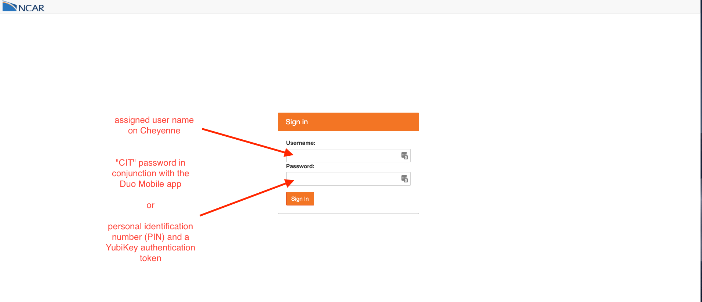
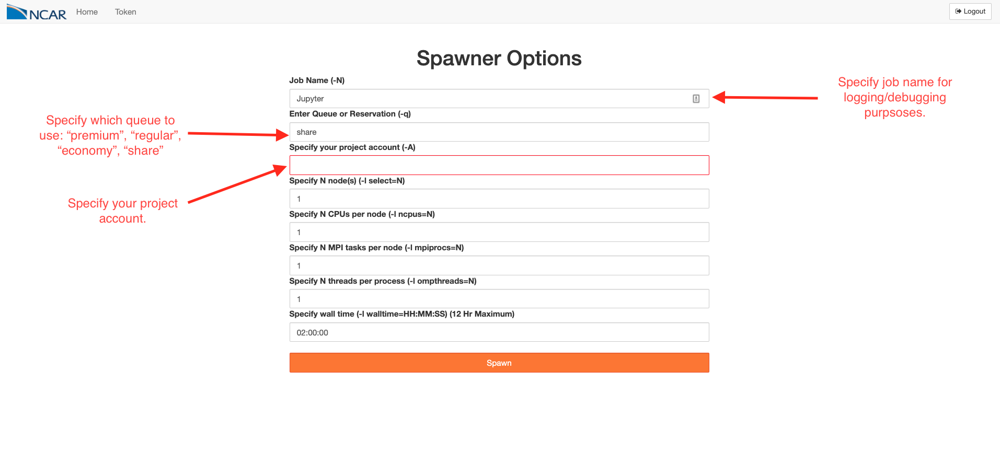

## Turning HPC Systems into Interactive Data Analysis Platforms using Jupyter and Dask


_Anderson Banihirwe, Software Engineer_

National Center for Atmospheric Research


### Motivation

- _Context:_ Scientists iterate rapidyly searching for insight as they analyze critical, large datasets.
- _Problem:_ High Performance Computing (HPC) systems are a bit hard to use with anything other than MPI.
- _Goal:_ Support interactive analytics on HPC systems as a first class service.


### Jupyter on HPC systems


**Commonly, inconvenient used setup:**

1. **SSH-in**

```console
$ ssh <remote_user>@<remote_host>
```

2. **Launch Jupyter on a remote machine**

```console
$ jupyter lab --no-browser --ip=`hostname` --port=<port>
```

3. **From the local machine, set up SSH-tunnel to the remote machine**

```console
$ ssh -N -L <port>:<hostname>:<port> <remote_user>@<remote_host>
```

4. **Open the notebook in a browser on the local machine**

```console
$ open http://localhost:<port>/
```


### JupyterHub to rescue

- Provide a general-purpose point-of-entry to interactive high performance computing services.
- Centralized service to deploy notebooks in a standard authenticated manner.


### JupyterHub @ NCAR: Login




### JupyterHub @ NCAR: Specifying Job Configuration




### JupyterHub @ NCAR: A Running Jupyter Server


### The solution: Dask on HPC Machines

- To facilitate deploying dask on HPC systems, `dask-jobqueue` package was created as a spinoff of the Pangeo project.

* Dask-jobqueue allows launching Dask on traditional HPC job schedulers like:
  - PBS
  - SLURM
  - SGE
  - Torque
  - LSF
  - and others commonly found on HPC systems

- Dask-jobqueue provides a _Pythonic_ user interface that manages dask workers/clusters through
  - submission
  - execution
  - and deletion of individual jobs on an HPC system

* Dask-jobqueue gives users the ability to interactively scale workloads across large HPC systems; turning an interactive Jupyter Notebook into a powerful tool for scalable computation on very large datasets.


### Dask-Jobqueue Setup

```python
from dask_jobqueue import PBSCluster
cluster = PBSCluster(project=..., queue=..., cores=1,
                     processes=1, memory="20GB",
                     walltime="00:30:00")
```

The cluster object stores essentially a configuration for a block of worker nodes that you will be requesting:

```python
print(cluster)
PBSCluster(cores=0, memory=0 B, workers=0/0, jobs=0/0)
```


### Dask-jobqueue Setup

```python
from dask_jobqueue import SLURMCluster
cluster = SLURMCluster(project=..., queue=..., cores=1,
                       processes=1, memory="20GB",
                       walltime="00:30:00")
```


### Dask-jobqueue Setup

```python
from dask_jobqueue import SGECluster
cluster = SGECluster(project=..., queue=..., cores=1,
                     processes=1, memory="20GB",
                     walltime="00:30:00")
```


### Scaling

- Scale cluster to n dask workers


### Scaling: Manual

```python
cluster.scale(10)
```


### Scaling: Adaptive Scaling based on load

```python
cluster.adapt(minimum=1, maximum=100, wait_count=60)
```


### Advantages of adaptive scaling

- Configuring clusters to balance resources and performance can be challenging, and requires a lot of experimentation.
- Computational workloads aren't constant, they rather fluctuate throughout the analysis.
- Start your Jupyter Notebook, instantiate your dask cluster, and then do science
- Let dask determine when to scale up and down depending on the commputational workload
- The bursting approach to interactive parallel computing offers many benefits
