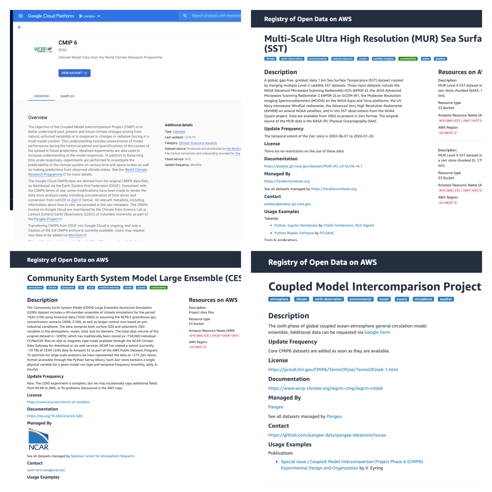

**chunked, compressed, multidimensional arrays**

_Anderson Banihirwe ([@andersy005](https://github.com/andersy005)), Software Engineer_

National Center for Atmospheric Research (NCAR)

Cloud Native Geospatial Outreach Day | 2020-09-08
<aside class="notes">
    <ul>
      <li>Thanks for the opportunity to speak.</li>
      <li>I work as a software engineer @ the National Center for Atmospheric Research (aka NCAR).</li>
      <li>Today, I am just going to talk about zarr.</li>
   </ul>
  </aside>

## Why Care?

Geo-spatial data come in several different data formats

## Why Care?

Traditional data formats:

- netCDF
- HDF5
- GeoTIFF

These formats are effective for traditional disk storage, but are less efficient for modern cloud-focused technologies. 

## Why Care?

Newer cloud optimized data formats:

- Cloud Optimized GeoTIFF (COG): [cogeotiff](https://github.com/cogeotiff)
- TileDB: [TileDB-Inc/TileDB](https://github.com/TileDB-Inc/TileDB)
- **Zarr**

### Why Care?

A growing list of analysis ready, public geo-spatial datasets in zarr format:

## What is Zarr?

- [Zarr](https://zarr-specs.readthedocs.io/en/core-protocol-v3.0-dev/index.html) is foremost **a data model/specification** that provides a protocol for storing and retrieving chunked, compressed multi-dimensional arrays.

- As of today, the zarr spec has implementations in the following languages:
  - **Python**: [zarr-developers/zarr-python](https://github.com/zarr-developers/zarr-python)
  - **TypeScript**: [gzuidhof/zarr.js](https://github.com/gzuidhof/zarr.js/)
  - **C++**: [constantinpape/z5](https://github.com/constantinpape/z5)
  - **Julia**: [meggart/zarr.jl](https://github.com/meggart/Zarr.jl)
  - **Java**: [saalfeldlab/n5-zarr](https://github.com/saalfeldlab/n5-zarr)
  - **Scala**: [lasersonlab/ndarray.scala](https://github.com/lasersonlab/ndarray.scala)
  - **C**: [Unidata/netcdf-c/libnczarr](https://github.com/Unidata/netcdf-c/tree/master/libnczarr)

## Core Features

## Core Features: Chunks

## Core Features: Compression

[zarr-developers/numcodecs](https://github.com/zarr-developers/numcodecs) Python package provides a high level API for configuring compression and filters for zarr arrays.

- **lossless**: reversible i.e. data can be restored in its original form.
- **lossy**: irreversible i.e. some information is lost (can't go back to the original)

## Core Features: Compression

## Core Features: Storage

- In-Memory Store (Dictionary, Memory, LRUCache)
- Database Store (SQLite, Redis, MongoDB, etc..)
- POSIX filesystem (Directory store, Zip store)
- Cloud Object Storage (GCS, S3, Azure, etc...)
- Bring Your Own. **Zarr arrays can be stored in any key-value store**

### Learning more

*Other Zarr sessions/talks to be delivered @ Cloud Native Geospatial Outreach Day*:

- **2020 NASA SpaceApps Challenge and OceanHackweek: Cloud Optimized GeoTiffs and Zarr on AWS PDS** - Aimee Barciauskas
- **Introduction to Multi-Scale Ultra High Resolution (MUR) Sea Surface Temperature (SST) Zarr on AWS PDS** - Aimee Barciauskas

### Thanks!
